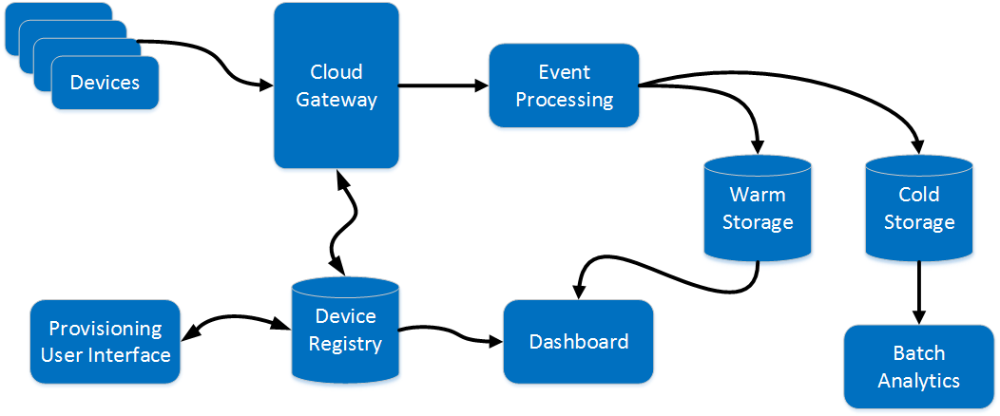

## About the Reference Implementation

Our reference implementation is designed to test and validate our assumptions, and to keep our guidance honest. 

## The example scenario

To motivate the reference implementation, and to make things more concrete, we chose an example scenario, based on the idea of *smart buildings*.

A smart building tracks and controls its internal environment. Sensors monitor the temperature, ambient light, and humidity, to help ensure the comfort of the occupants. A smart building can also incorporate safety devices, such as smoke detectors and intruder alarms. Data captured from these monitoring devices can be used to control air conditioning, lighting, sprinklers, automatic fire doors, or to alert the authorities if an emergency situation is detected.

Here are the scenario parameters that we decided on:

- Fabrikam is a software development company that provides environmental monitoring services on a contractual basis. They will manage the cloud service on behalf of customers.
- The system should support **100,000 provisioned devices**. We'll use a simulator to simulate device events.
- Each device will send approximately **1 event per minute**. This means the system will need to ingest **~ 1,667 events per second**.
- Authorized users can provision and de-provision individual devices. 
- All telemetry (the events sent from the devices) is stored indefinitely.
- We want the ability to submit Hive queries on the stored telemetry data.
- Authorized users can see an aggregated recent state for a given building. For example, what is the average temperature in Building 25 currently? 
- The service will be multi-tenant. Users might include the owner of a particular building, a resident, a building management company, etc.      
- The system can support legacy devices that don't conform to any standard protocol for transmitting and receiving data. (Protocol translation.)
- The solution should support continuous deployment, to avoid downtime during upgrades.

Our goal was to make the scenario representative of typical IoT solutions, so the lessons we learn will apply more broadly.  

## Architecture

Before we even get to specific implementations, here is the logical architecture that we are proposing:

- _Cloud Gateway_ is a cloud-hosted service responsible for authenticating devices and (possibly) translating messages for devices that don't speak the standard language.
- _Event Processing_ is the part of the system that ingests and processes the stream of events. It is a composition point in the architecture allowing new downstream components to be added later.
- _Warm Storage_ holds the recent aggregated state for each building. It will receive this state from Event Processing. It is "warm" because the data should be recent and easily accessible.
- _Cold Storage_ is where all of the telemetry is stored indefinitely.
- _Device Registry_ knows which devices are provisioned. Its data is used by the Cloud Gateway as well as in the Dashboard.
- _Provisioning UI_ is a user interface for provisioning and de-provisioning devices.
- _Dashboard_ is a user interface for exploring the recent aggregate state.
- _Batch Analytics_ anticipates the Hive queries that the customer will want to run from time to time.

(Compare this diagram with the more general [logical architecture](02-architecting-IoT-solutions.md#logical-architecture) described in [Architecting an IoT solution](02-architecting-IoT-solutions.md).)

## Implementation

We approached the project in phases, building a functional part of the system in each phase. This strategy allowed us to evaluate the appropriate technologies and quickly deploy something concrete. 

1. **[Capturing event data][event-ingestion]**. It sounds obvious, but the most basic task for an IoT solution is getting event data into the cloud.

1. **[Saving raw event data in long-term storage][long-term-storage]**. Assuming that all event data must be stored indefinitely, the volume of data held in long-term storage could become very large. The storage must therefore be inexpensive.

1. **[Ad-hoc exploration][ad-hoc-exploration]**. This phase is concerned storing data for warm processing. Analysts and operators performing ad-hoc queries are unlikely to require the details of every historical event, so warm storage will only record the data for *recent* events. This will enable queries to run more quickly, and be more cost effective for expensive data stores that support the features required to run complex queries.

	As part of this phase, we also looked at aggregating the raw event data; for example, producing a rolling record of the average temperature reported by all devices in each building over the previous 5 minutes. 

1. **[Provisioning new devices][device-provisioning]**. 

[event-ingestion]: 04-event-ingestion.md
[long-term-storage]: 05-long-term-storage.md
[ad-hoc-exploration]: 06-ad-hoc-exploration.md
[device-provisioning]: 07-device-provisioning.md
