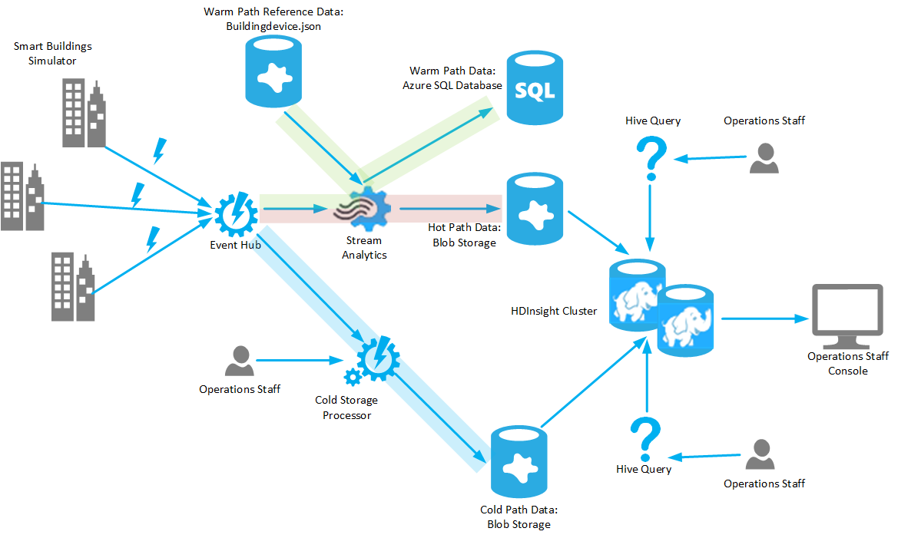

# Overview of the Architecture and Components in the Sample Solution

The sample solution code (available [here](https://github.com/mspnp/iot-journey/tree/master/src)) simulates a collection of smart buildings that monitor temperature in each apartment. Each monitoring device submits a temperature event every second containing the following data:

- The device ID (each device has its own unique ID).

- The currently observed temperature in degrees Celsius.

- The date and time of the observation.

The data for all devices is directed towards a Windows Azure Event Hub. From here, the data can take several paths:

1. The data can be used as input to a Azure Stream Analytics job which simply passes the data through to Blob storage, recording it in JSON format. This is the *hot path* that provides the least friction for the raw data, allowing it to be stored very quickly for later analysis. Operations staff are provided with a Hive query that they can run on an HDInsight cluster to take this data and generate a report listing each device and the number of events it generated.

2. The Stream Analytics job can also combine the data with reference information that maps device IDs to buildings. The reference information is held in Bloc storage. The combined data is then processed to generate a rolling average of the temperatures recorded by all devices in a building during the last 5 seconds. The results are stored in an Azure SQL Database. This is the *warm path*; it adds value to the raw data by merging and summarizing it. Operations staff can query this summary data in the database to view the average temperature in each building.

3. The data can queried by using the Cold Storage Processor. This is a separate application that can be run by operations staff. The Cold Storage Processor listens for temperature events as they arrive at the Event Hub (the Event Hub can also store a history of events for a configurable period, and these events will be passed to the Cold Storage Processor if it hasn't been run recently.) The Cold Storage processor copies the data for each temperature to Blob storage from where it can be subjected to detailed analysis and ad-hoc processing. This is the *cold path*. Another Hive query is available to enable operations staff to summarize this data and generate a report.

The following diagram illustrates the relationships between the components that constitute the sample solution:

For detailed information on building and running the solution, see these [instructions](https://github.com/mspnp/iot-journey/blob/master/docs/building-and-deploying-the-sample-solution.md).

